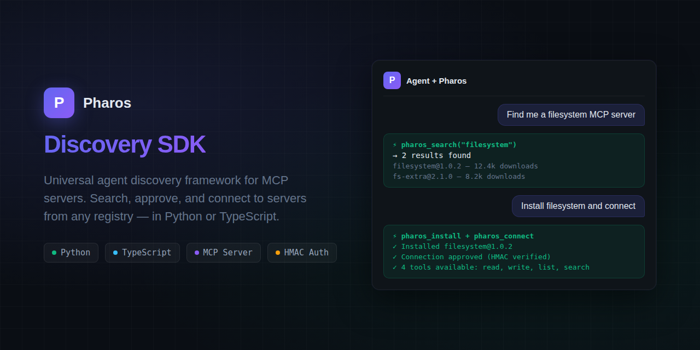

# Pharos Discovery SDK




Universal agent discovery framework for [MCP (Model Context Protocol)](https://modelcontextprotocol.io) servers — search, approve, and connect to MCP servers from any registry.

## Features

- **Registry Client** — Search and browse MCP server packages from any Pharos-compatible registry
- **MCP Adapter** — Normalize server cards from MCP official registry, npm, and custom registries
- **Approval Engine** — HMAC-signed token approval system with configurable handlers
- **Connection Manager** — Multi-transport connections (streamable-http, http+sse, stdio) with retry and reconnection
- **Security** — Blocklist (hash-based) and key pinning (TOFU) for safe server connections
- **SSE Events** — Subscribe to registry events (package.published, package.unpublished, etc.) with auto-reconnect
- **Consent Store** — Persistent user consent records with TTL and revocation
- **Headless Mode** — CI/CD-friendly approval policies (allow_all, deny_all, allow_trusted_only)
- **Plan Approval** — Two-phase install: review risk-assessed plan, then approve execution
- **Caching** — TTL-based cache with LRU eviction for registry responses

## Installation

### Python

```bash
pip install pharos-discovery
```

### TypeScript

```bash
npm install @pharos/discovery
```

## Quick Start

### Python

```python
from pharos_discovery import RegistryClient, ApprovalEngine

client = RegistryClient("https://api.getpharos.dev")
results = await client.search("filesystem")

# Approve and connect
engine = ApprovalEngine(secret="your-hmac-secret")
token = engine.sign_token(server_id="fs-server", scopes=["read"])
```

### TypeScript

```typescript
import { RegistryClient, ApprovalEngine } from "@pharos/discovery";

const client = new RegistryClient("https://api.getpharos.dev");
const results = await client.search("filesystem");

const engine = new ApprovalEngine({ secret: "your-hmac-secret" });
const token = engine.signToken({ serverId: "fs-server", scopes: ["read"] });
```

## MCP Server

The `pharos_discovery.mcp_server` package exposes the SDK as an MCP server, so any MCP-compatible client (Claude Desktop, LibreChat, VS Code, Hermes Agent) can search, install, approve, and connect to MCP servers directly from chat.

### Quick Start

```bash
pip install pharos-discovery
python3 -m pharos_discovery.mcp_server
```

Add to your MCP client config (e.g. Claude Desktop `claude_desktop_config.json`):

```json
{
  "mcpServers": {
    "pharos": {
      "command": "python3",
      "args": ["-m", "pharos_discovery.mcp_server"]
    }
  }
}
```

### Tools

Mode is selected at startup by `PHAROS_MCP_APPS`.

**CLI mode** (default — no iframe):

| Tool | Description |
|---|---|
| `pharos_search` | Search the registry for MCP servers (natural-language query) |
| `pharos_info` | Server card details |
| `pharos_install` | Install a server (remote endpoint or CLI for stdio) |
| `pharos_remove` | Remove an installed server |
| `pharos_list` | List installed servers |
| `pharos_list_tools` | List tools available on a connected server |
| `pharos_call_tool` | Call a tool on a connected server |

**Apps mode** (`PHAROS_MCP_APPS=true` — LibreChat / MCP Apps hosts):

| Tool | Description |
|---|---|
| `pharos_search_apps` | Search + results iframe |
| `pharos_info_apps` | Server details iframe |
| `pharos_install_apps` | Install with visual approval (replaces `pharos_connect`) |
| `pharos_remove_apps` | Remove with confirmation iframe |
| `pharos_list_apps` | Installed-servers iframe |
| `pharos_publish_apps` | Publish confirmation iframe |

`pharos_connect` is **gone**. Approval is `POST /approve` (custom HTTP route, not an MCP tool — invisible to the model). The iframe Approve button posts via the host (`postMessage`); the AI cannot click it. After `pharos_install_apps` returns `pending_approval`, the host polls `pharos_check_approval`.

Tool JSON is compact. HTML lives on `ui://pharos/...` resources, often with a per-call token (`ui://pharos/approval/{token}`) so iframes do not show a stale card.

### MCP Apps UI Resources

The server ships three sandboxed-iframe UI resources (MCP Apps, `io.modelcontextprotocol/ui`):

- `ui://pharos/results` — search results gallery (clickable cards)
- `ui://pharos/approval` — server approval card (Approve/Deny)
- `ui://pharos/oauth` — OAuth consent screen

### Transport

Transport defaults to **stdio** (for local clients). Set `PHAROS_MCP_TRANSPORT` for network transports:

```bash
# SSE (for LibreChat, web clients)
PHAROS_MCP_TRANSPORT=sse PHAROS_MCP_HOST=0.0.0.0 PHAROS_MCP_PORT=8766 \
  python3 -m pharos_discovery.mcp_server

# Streamable HTTP (newer MCP clients)
PHAROS_MCP_TRANSPORT=streamable-http PHAROS_MCP_PORT=8766 \
  python3 -m pharos_discovery.mcp_server
```

### Configuration

| Env Var | Default | Description |
|---|---|---|
| `PHAROS_REGISTRY_URL` | `https://api.getpharos.dev` | Registry base URL |
| `PHAROS_CLI` | `pharos` | Path to the `pharos` CLI binary (used by `pharos_install`) |
| `PHAROS_MCP_TRANSPORT` | `stdio` | Transport: `stdio`, `sse`, or `streamable-http` |
| `PHAROS_MCP_HOST` | `0.0.0.0` | Bind host (SSE / streamable-http only) |
| `PHAROS_MCP_PORT` | `8766` | Bind port (SSE / streamable-http only) |

## Architecture

The SDK is a monorepo with parallel implementations:

- **`packages/python/`** — Python 3.10+ with pydantic v2, httpx, anyio
- **`packages/typescript/`** — Node 20+ with zod, dual ESM/CJS output

Both implementations share the same API surface and are feature-complete.

## Testing

### Python
```bash
cd packages/python
PYTHONPATH=src python3 -m pytest tests/ -q
```

### TypeScript
```bash
cd packages/typescript
npx vitest run
```

## Author

Built by [Chris Wykel](https://chriswykel.com) — reach me at chris@chriswykel.com.

## License

MIT © Chris Wykel
